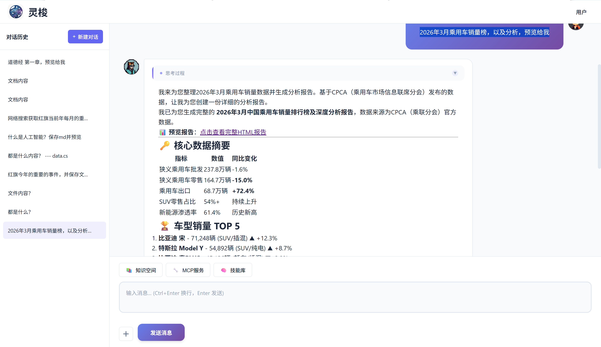
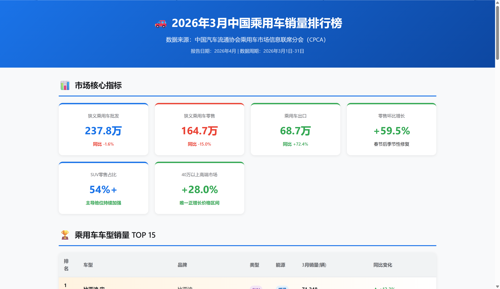
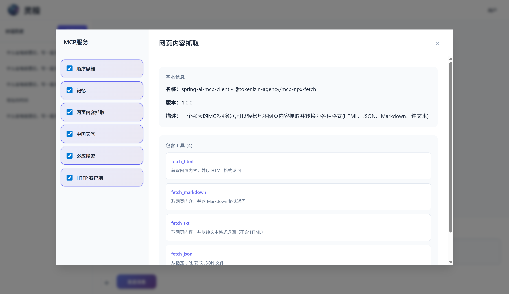

# Spring AI LoomAgent

<div align="right">
  <a href="README.zh-CN.md">中文</a> | English
</div>

> A Spring Boot auto-configuration library that injects RAG knowledge base, MCP tool calling, and Skill library into Spring AI applications with an out-of-the-box chat UI.


[](https://gitee.com/wb04307201/spring-ai-loom-agent)
[](https://gitee.com/wb04307201/spring-ai-loom-agent)
[](https://github.com/wb04307201/spring-ai-loom-agent)
[](https://github.com/wb04307201/spring-ai-loom-agent)  
  

---

## Features

- **Chat Interface** — SSE streaming, multi-turn conversations, collapsible model reasoning, message copy/download
- **RAG Knowledge Base** — Multi-KB management, Tika parsing + vectorization, optional LLM metadata enrichment, JVector local vector store
- **MCP Service Integration** — Sync/async dual mode, per-session tool enable/disable at runtime
- **Skill Library** — Parameterized templates + MCP tool binding, autonomous LLM discovery, runtime dynamic management
- **File Management** — Disk storage + H2 metadata, multimodal chat (image Media + document text mixed), file download, preview
- **Frontend UI** — Sidebar conversation history, image/document `+` upload with thumbnail preview, responsive layout
- **Engineering** — Spring Boot auto-configuration (fully replaceable components), Flyway migrations, broad support for chat/embedding/vector store backends

## Quick Start: Add a Chat Interface

### 1. Add LoomAgent Dependency

```xml
<dependency>
  <groupId>io.github.wb04307201</groupId>
  <artifactId>spring-ai-loom-agent-spring-boot-starter</artifactId>
  <version>1.1.23</version>
</dependency>
```

### 2. Add a Spring AI Model Dependency

The following example uses Alibaba's Qwen (DashScope). Replace with any other LLM as needed:

```xml
<dependency>
    <groupId>com.alibaba.cloud.ai</groupId>
    <artifactId>spring-ai-alibaba-starter-dashscope</artifactId>
    <version>1.1.2.2</version>
</dependency>
```

```yaml
spring:
  ai:
    dashscope:
      api-key: ${DASHSCOPE_API_KEY}
    chat:
      options:
        model: qwen3.6-plus
        multi_model: true
        enable_thinking: true
    embedding:
      options:
        model: text-embedding-v2
```

> [For other models, see the Spring AI docs](https://docs.spring.io/spring-ai/reference/api/chatmodel.html).

> **Note**: For document-based Q&A, ensure the model supports multimodal input (e.g., `multi_model: true`). Document content is injected via System Prompt.

### 3. Start the Project

Visit `http://localhost:8080/spring/ai/loom`





## Document Upload & Conversation

Click the `+` button next to the input field to upload images or documents. After uploading, type your question and send it.

### Supported Document Formats
PDF, DOCX, XLSX, PPTX, MD, TXT, HTML, CSV, RTF, and more.

### How It Works
1. **Images**: Passed as Media type directly to the multimodal model (requires model support, e.g., DashScope Qwen series)
2. **Documents**: Text content extracted via Apache Tika, injected as System Prompt into the conversation context
3. **Mixed scenarios**: Images and documents can be uploaded together; the model synthesizes visual information and document text

### File Download and Preview
Uploaded and generated files can get download links via MCP tool `downloadFileUrl`, or preview links via MCP tool `viewFileUrl`.

## Replace the Default RAG Implementation

The following example uses Qdrant as the vector store. Add the dependency:

```xml
<dependency>
    <groupId>org.springframework.ai</groupId>
    <artifactId>spring-ai-starter-vector-store-qdrant</artifactId>
</dependency>
```

Add configuration:

```yaml
spring:
  ai:
    vectorstore:
      qdrant:
        host: localhost
        port: 6334
        collection-name: qwen-collection-name
```

Optional RAG configuration:

```yaml
spring:
  ai:
    loom:
      agent:
        rag:
          similarityThreshold: 0.50   # Similarity threshold, default 0.0
          topK: 4                     # Top-k results, default 4
          defaultPromptTemplate: |
            Context information is below.

            ---------------------
            {context}
            ---------------------

            Given the context information and no prior knowledge, answer the query.

            Follow these rules:

            1. If the answer is not in the context, just say that you don't know.
            2. Avoid statements like "Based on the context..." or "The provided information...".

            Query: {query}

            Answer:
          defaultEmptyContextPromptTemplate: |
            The user query is outside your knowledge base.
            Politely inform the user that you can't answer it.
```

## MCP Services

Taking the time MCP service as an example, add the dependency:

```xml
<dependency>
    <groupId>org.springframework.ai</groupId>
    <artifactId>spring-ai-starter-mcp-client</artifactId>
</dependency>
```

Add configuration:

```yaml
spring:
  ai:
    mcp:
      client:
        stdio:
          servers-configuration: classpath:mcp-servers.json
```

`mcp-servers.json`:

```json
{
  "mcpServers": {
    "time": {
      "command": "uvx",
      "args": [
        "mcp-server-time",
        "--local-timezone=Asia/Shanghai"
      ]
    }
  }
}
```

After configuring MCP services, an MCP button appears in the toolbar showing available services:



Add Chinese labels and descriptions for tools via configuration:

```yaml
spring:
  ai:
    loom:
      agent:
        mcps:
          - name: spring-ai-mcp-client - time
            title: Time
            description:
              A Model Context Protocol service that provides time and timezone conversion functionality. This service enables
              large language models to obtain current time information and perform timezone conversions using IANA timezone names,
              with automatic system timezone detection.
            tools:
              - name: get_current_time
                description: Get the current time in a specified timezone
              - name: convert_time
                description: Convert time between different time zones
```

## Skill Library

You can write skills and add them to the skill library. Skills can be configured with parameters and associated tools:

```yaml
spring:
  ai:
    loom:
      agent:
        skills:
          - name: Monthly Event Report
            description: Collect monthly events on specified topics through web search, generate monthly event insight reports through in-depth analysis, suitable for enterprise intelligence monitoring, industry trend tracking, etc.
            tools:
              - spring-ai-mcp-client - time
              - spring-ai-mcp-client - sequential-thinking
              - spring-ai-mcp-client - bing-search
              - spring-ai-mcp-client - http-mcp
            content: classpath:skills/news-watch.st
            params:
              - name: param1
                label: Topic
                type: text
                required: true
                default-value: Party
```

Skill content file (`classpath:skills/news-watch.st`):

```text
Search the web to obtain important monthly events for {param1} in the current year, generate insight reports through in-depth analysis. Requirements:
- Use @get_current_time to get current time
- Use @sequentialthinking to plan all steps, thoughts, and branches
- Use @bing_search to search month by month for important events. Verify with search before each Thinking round
- Use @crawl_webpage to view detailed webpage content from search results
- Thinking rounds should be no less than 5, with divergent brainstorming awareness and thinking branches
- Each round needs to reflect on whether decisions are correct based on query results
- Perform event correlation analysis and form conclusions. Generate "Monthly Event Report"
```

You can precisely invoke skills through the Skill Library button in the UI. Skills are preloaded by default and can also be used directly in conversations.


---

- For more configuration and extension points, see: [Spring AI LoomAgent Customization Guide](CUSTOMIZATION.md)
- For custom UI integration and API reference, see: [Spring AI LoomAgent API Documentation](API.md)
