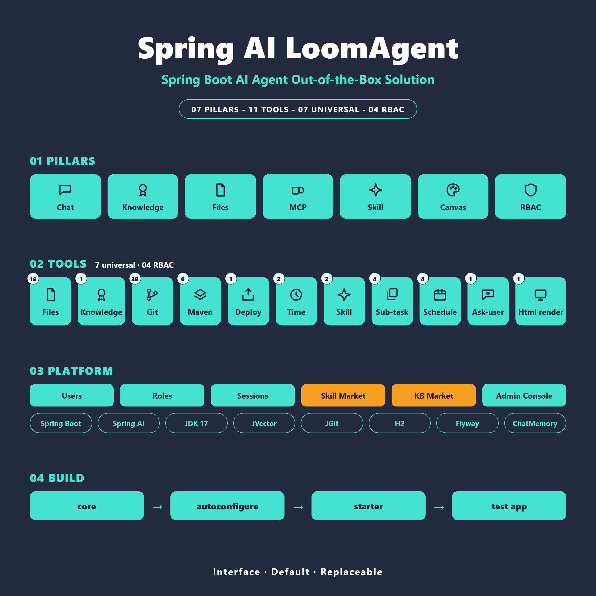
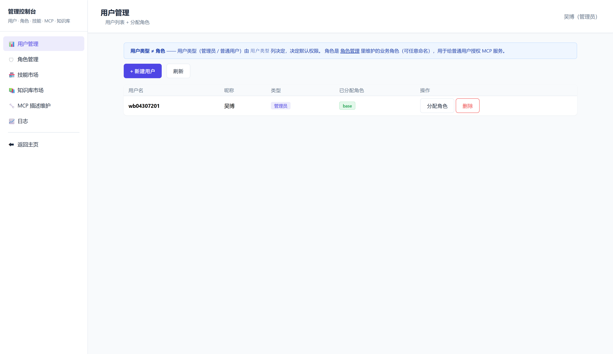
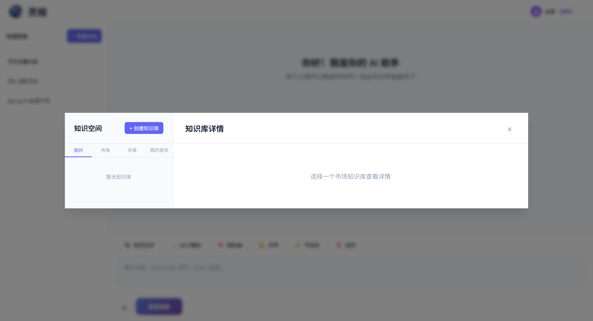
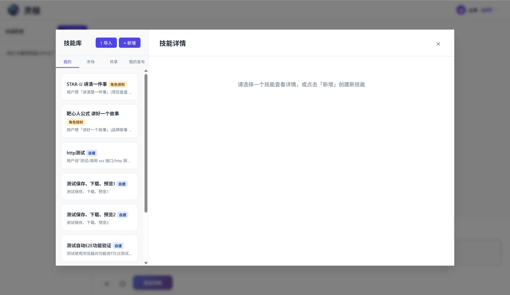

# Spring AI LoomAgent

<div align="right">
 <a href="README.zh-CN.md">中文</a> | English
</div>

> Spring Boot AI Agent — an out-of-the-box solution that makes your app **converse**, **remember**, **think**, and **act**.


[](https://gitee.com/wb04307201/spring-ai-loom-agent)
[](https://gitee.com/wb04307201/spring-ai-loom-agent)
[](https://github.com/wb04307201/spring-ai-loom-agent)
[](https://github.com/wb04307201/spring-ai-loom-agent) 
   

<p style="display: flex">
 
 
</p>

---

## Features

> **6 Pillars**: 💬 Chat · Knowledge · 📁 Files · 🔧 MCP · 🧠 Skill · 🛡 RBAC
> **Platform**: 🧠 Skill Market · Knowledge Market · 🎛 Admin Console
> **Advanced**: 🧩 Sub-tasks · ⏰ Scheduled tasks · 🖼 Multimodal — one dependency, batteries included.

- **💬 Streaming Chat** — SSE multi-turn, collapsible reasoning, message copy/download; **multimodal** image + document mixed input
- **📚 RAG Knowledge Base** — Multi-KB management, Tika parsing + vectorization, built-in H2-backed vector store (JVector HNSW in-memory index; swap in any Spring AI vector store)
- **🔧 MCP Tool Integration** — Sync/async dual mode; available tools gated by **role authorization**, enabled per chat
- **🧠 Skill Market** — DB-stored prompt templates, **3 sources** (self-built / market-pulled / role-granted); approval flow (submit → PENDING → admin approve/reject, rejected re-submits archive the old row); pull rejects overwriting same-name USER_CREATED; remove blocked when `market_skill_id` is set; admin can create (lands APPROVED immediately) / edit / approve / reject; no version field. Skills call MCP via `@tool_name`. Frontend chat input supports `/` picker for precise skill selection.
- **🧩 Sub-tasks & ⏰ Scheduled Tasks** — Delegate a slice of work to a synchronous "sub-model"; LLM-created schedules run as sub-tasks and survive restarts
- **🙋 AskUser Interactive Tool** — the AI asks you questions inline in the chat stream via option cards (single-select / multi-select / custom input), then seamlessly continues after you answer; sub-tasks and scheduled tasks never interrupt you
- **🛡 RBAC** — Two levels: user type (admin / user) + business roles; admin sees all, normal users get the union of their roles' grants
- **🎛 Admin Console** — Sidebar SPA: users / roles / skill market / knowledge market / MCP descriptions / logs (formerly usage stats); admin-gated
- **📁 File Management** — Disk storage + H2 metadata, upload / preview / download, chat-attachment bridging
- **🧰 Built-in Tools** — Time / file / skill / sub-task / schedule / askUser / end-to-end deploy (on by default), git / maven (opt-in); see [TOOLS.md](docs/TOOLS.md)
- **⚙️ Batteries-included Engineering** — Spring Boot auto-config, every bean replaceable via `@ConditionalOnMissingBean`, Flyway migrations, broad chat / embedding / vector-store support

## Built-in Tools

All tools follow the **interface + default implementation** pattern. Every component is registered with `@ConditionalOnMissingBean`, allowing consumers to replace any piece with a custom implementation.

| Tool | Interface | Methods | Default | Config Property |
|------|-----------|---------|---------|-----------------|
| Time | `ITimeTool` | 2 | ✅ enabled | `time.enabled` |
| File | `IFileTool` | 16 | ✅ enabled | `file.enabled` |
| Skill | `ISkillTool` | 3 | ✅ enabled | `skill.enabled` |
| Knowledge | `IKnowledgeTool` | 1 | ✅ enabled | `knowledge.enabled` |
| Sub-task | `ISubTaskTool` | 4 | ✅ enabled | `subtask.enabled` |
| Schedule | `IScheduleTool` | 4 | ✅ enabled | `schedule.enabled` |
| AskUser | `IAskUserTool` | 1 | ✅ enabled | `askuser.timeoutSeconds` |
| Git | `IGitTool` | 28 | ❌ disabled | `git.enabled` |
| Maven | `IMavenTool` | 6 | ❌ disabled | `maven.enabled` |
| Compile & Deploy | `ICompileAndDeployTool` | 1 | ✅ enabled | `compile.enabled` |

For full `@Tool` method signatures, parameter details, and configuration reference, see [TOOLS.md](docs/TOOLS.md).

### Compile & Deploy Tool


### Admin Console



### Standalone MCP Servers

File, Git, Maven, and Compile each have a **standalone MCP server module** — the core layer has no Spring dependency and can be deployed via jbang to any MCP-compatible agent (Claude Desktop, Cursor, etc.):

| MCP Server | Description | README |
|------------|-------------|--------|
| `loom-file-mcp` | File system operations — read, write, edit, search, directory browsing, delete (14 tools) | [EN](loom-file-mcp/README.md) · [中文](loom-file-mcp/README.zh-CN.md) |
| `loom-git-mcp` | Git operations via JGit — clone, commit, push, merge, rebase, and more (14 tools) | [EN](loom-git-mcp/README.md) · [中文](loom-git-mcp/README.zh-CN.md) |
| `loom-maven-mcp` | Maven build operations — execute, build, package, test, dependency tree, validate (6 tools) | [EN](loom-maven-mcp/README.md) · [中文](loom-maven-mcp/README.zh-CN.md) |
| `loom-compile-mcp` | End-to-end deploy pipeline — git clone → build → docker build → docker run → health check (1 tool) | [EN](loom-compile-mcp/README.md) · [中文](loom-compile-mcp/README.zh-CN.md) |

## Quick Start: Add a Chat Interface

### 1. Add LoomAgent Dependency
```xml
<dependency>
 <groupId>io.github.wb04307201</groupId>
 <artifactId>spring-ai-loom-agent-spring-boot-starter</artifactId>
 <version>1.1.40</version>
</dependency>
```

### 2. Add a Spring AI Model Dependency
The test application uses Alibaba's Qwen (DashScope) via Spring AI Alibaba. Swap the dependency and config for any other provider:
```xml
<dependency>
 <groupId>com.alibaba.cloud.ai</groupId>
 <artifactId>spring-ai-alibaba-starter-dashscope</artifactId>
 <version>1.1.2.3</version>
</dependency>
```

```yaml
spring:
 ai:
 dashscope:
 api-key: ${DASHSCOPE_API_KEY}
 chat:
 options:
 model: qwen3.7-plus
 multi_model: true
 enable_thinking: true
```

> [For other models, see the Spring AI docs](https://docs.spring.io/spring-ai/reference/api/chatmodel.html).

> **Note**: For document-based Q&A, ensure the model supports multimodal input (e.g., `multi_model: true`). Document content is injected via System Prompt.

### 3. Start the Project
Visit `http://localhost:8080/spring/ai/loom`




## Document Upload & Conversation
Click the `+` button next to the input field to upload images or documents. After uploading, type your question and send it.

### Supported Document Formats
PDF, DOCX, XLSX, PPTX, MD, TXT, HTML, CSV, RTF, and more.

### How It Works
1. **Images**: Passed as Media type directly to the multimodal model (requires model support, e.g., DashScope Qwen series)
2. **Documents**: Text content extracted via Apache Tika, injected as System Prompt into the conversation context
3. **Mixed scenarios**: Images and documents can be uploaded together; the model synthesizes visual information and document text

### File Download, Preview, and Deletion
Uploaded and generated files can get download links via MCP tool `downloadFileUrl`, or preview links via MCP tool `viewFileUrl`. Files and directories can be removed via MCP tool `deleteFileOrDirectory` (requires explicit `I_CONFIRM_DELETE` confirmation — token configurable via `spring.ai.loom.agent.file.deleteConfirmToken`, supports recursive directory removal, and cleans up temporary `file_info` records).

The "File" entry provides unified browsing, previewing, downloading, and deleting for all non-knowledge-base files (including tool uploads and git repositories).

## Replace the Default RAG Implementation
The following example uses Qdrant as the vector store. Add the dependency:
```xml
<dependency>
 <groupId>org.springframework.ai</groupId>
 <artifactId>spring-ai-starter-vector-store-qdrant</artifactId>
</dependency>
```

Add configuration:

```yaml
spring:
 ai:
 vectorstore:
 qdrant:
 host: localhost
 port: 6334
 collection-name: qwen-collection-name
```

Optional RAG configuration:

```yaml
spring:
 ai:
 loom:
 agent:
 rag:
 similarityThreshold: 0.50 # Similarity threshold, default 0.0
 top-k: 4 # Top-k results, default 4
```

## MCP Services

Taking the time MCP service as an example, add the dependency:

```xml
<dependency>
 <groupId>org.springframework.ai</groupId>
 <artifactId>spring-ai-starter-mcp-client</artifactId>
</dependency>
```

Add configuration:

```yaml
spring:
 ai:
 mcp:
 client:
 stdio:
 servers-configuration: classpath:mcp-servers.json
```

`mcp-servers.json`:

```json
{
 "mcpServers": {
 "time": {
 "command": "uvx",
 "args": [
 "mcp-server-time",
 "--local-timezone=Asia/Shanghai"
 ]
 }
 }
}
```

The MCP button opens a panel showing available services:




Add Chinese labels and descriptions for tools via configuration:

```yaml
spring:
 ai:
 loom:
 agent:
 mcps:
 - name: spring-ai-mcp-client - time
 title: Time
 description:
 A Model Context Protocol service that provides time and timezone conversion functionality. This service enables
 large language models to obtain current time information and perform timezone conversions using IANA timezone names,
 with automatic system timezone detection.
 tools:
 - name: get_current_time
 description: Get the current time in a specified timezone
 - name: convert_time
 description: Convert time between different time zones
```

## Skill Market

Skills are prompt templates that the LLM uses for recurring workflows. The data is **fully managed in the database** (no more yml `skills[]` block) and lives in three tables:

| Table | Purpose |
|----------------|-----------------------------------------------------------------------------------------------|
| `market_skill` | Public **Skill Market** — every entry has only a `(author, name)` unique constraint (the `version` field has been removed); admin creates (direct `APPROVED`) / edits / approves / rejects / pulls |
| `user_skill` | A user's local copy of a skill (`source = USER_CREATED / MARKET_PULLED / ROLE_GRANTED`); remove blocked when `market_skill_id` is set; pull rejects overwriting same-name USER_CREATED |
| `role_skill` | Role → market_skill authorization (which skills a role unlocks for its users), written via `ISkillRoleAdmin.setRoleSkills`; granted skills sync into each user's `user_skill` (locked `ROLE_GRANTED` entries) lazily on their next skill list/get |

### 6 seeded system skills

On first launch, the demo init migration seeds 6 system skills (stored directly in the default admin user's `user_skill` with `source=USER_CREATED`, `default_loaded=true`) so a fresh install already has useful ones — including **Monthly Event Report**, **HTTP Test**, **Deploy Project**, **Auto E2E**, etc. Admins can create / edit / approve / reject / delete market skills from the **Skill Market** admin page.

### Skill lifecycle for a normal user

1. **Create** — In the chat UI's Skill Library → **我的** tab → **+ 新增**, or `PUT /spring/ai/loom/skill`. The skill is stored in `user_skill` with `source=USER_CREATED`. Fully editable (name / desc / content / default-loaded).
2. **Submit to market** — Library → **共享** tab. Click your skill, the form shows market metadata （无版本号）。 Submitted with `status=PENDING` — awaits admin approve/reject (reject requires a comment). Re-submitting a same `(author, name)` entry: if it was **REJECTED**, the old row is archived (reject comment/reviewer/time preserved) and a NEW PENDING row is created; if **PENDING / APPROVED**, content updates in place and status is untouched (APPROVED never demotes).
3. **Pull from market** — Library → **市场** tab. Click item → right panel shows full details + **「拉取到我的 Skill」** button. Creates / refreshes a `user_skill` row with `source=MARKET_PULLED`. Re-pull of same name UPSERTs (no error).
 - **Note**: If you already have a same-name `USER_CREATED` skill, pull is rejected (403) — use **「复制为我的技能」** first to copy as a new `USER_CREATED`.
4. **Receive via role authorization** — If admin granted a role → market_skill, the skill is auto-synced into your `user_skill` on every skill list/get with `source=ROLE_GRANTED, locked=true`. **You cannot edit or delete it** (it's pinned by the role).

### What admins can do that normal users cannot

- **Create** (direct `APPROVED`, `created_by_kind='ADMIN'`), **edit / approve / reject / 下架 (delete)** any `market_skill` — authors publish from the chat UI into PENDING; admins review or create directly
- Authorize any APPROVED market skill to any role via `role_skill` (auto-syncs to all assigned users)
- 下架 cascades to all `user_skill` (pullers) and `role_skill` (role grants) — no orphans

### Permission matrix

| Operation | USER_CREATED | MARKET_PULLED | ROLE_GRANTED |
|----------------------------------------|--------------|---------------|--------------|
| Edit `name` | ✗ (PK) | ✗ | ✗ |
| Edit `description` | ✅ | ✗ (locked to market snapshot) | ✗ |
| Edit `content` | ✅ | ✗ (re-pull) | ✗ |
| Edit `default_loaded` | ✅ | ✅ | ✗ |
| Delete | ✅ | ✅ | ✗ |
| Submit to market | ✅ | ✗ | ✗ |

### Using skills in the chat UI

Open the Skill Library button (🧠) — four tabs:

- **我的** — your local `user_skill` (admin sees only their own `user_skill` — no union view). Click a skill to see details, then **应用** (overwrite the textarea and **auto-send** to the model) or **复制** (overwrite the textarea, no send).
- **市场** — browse all `APPROVED` market skills and **拉取** them into your `user_skill` (rejects if you already have a same-name `USER_CREATED`).
- **共享** — submit a `USER_CREATED` skill to the market. Submission goes to `PENDING` awaiting admin approval. no version number. two-stage click list item → right panel form.
- **我的发布** — track your market submissions (PENDING / APPROVED / REJECTED, with the reject reason shown). Click list item → right panel with a withdraw button (label varies by status: 撤回投稿 / 下架并删除 / 删除被拒记录). Author withdraw removes the market entry and clears the author's own `user_skill.market_skill_id` backlink — other users' already-pulled copies (`MARKET_PULLED`) and `role_skill` grants remain but stop receiving updates. (It's the **admin** 下架/delete that cascades cleanup to `user_skill` + `role_skill`.) REJECTED entries can be re-submitted — the old row is archived and a fresh PENDING row is created.

Inside `content` you can reference MCP tools by `@tool_name` — the available tools come from the role-based `mcps` authorization, not from yml.

For the full REST API, see [docs/API.md → §6 Skill Management](docs/API.md#6-skill-management).
## Knowledge Base & Knowledge Market

Knowledge bases store documents for RAG retrieval. The knowledge space modal has four tabs:

- **我的** — your own knowledge bases. Create, upload documents, delete.
- **市场** — browse approved market knowledge bases and **添加到我的知识库** (subscribe).
- **共享** — your own knowledge bases not yet shared. Click **共享到市场** to submit for admin approval.
- **我的发布** — track your market submissions (PENDING / APPROVED / REJECTED, with the reject reason shown). Withdraw is available at any status (label varies: 撤回投稿 / 下架并删除 / 删除被拒记录) — withdrawing deletes the market entry and, on the knowledge side, cascades cleanup of `loom_user_knowledge` subscriber rows + `loom_role_knowledge` grants. REJECTED entries can be re-submitted — the old row is archived (`loom_market_knowledge_archive`) and a fresh PENDING row is created.

Market workflow: submit → PENDING → admin approve → APPROVED → other users can subscribe. Role-based authorization can also auto-grant knowledge bases to users (similar to skills).

For the knowledge market REST API, see [docs/API.md → §5.8 Knowledge Market](docs/API.md#58-knowledge-market).

---

## Admin Console

The admin console is a sidebar-navigated single-page-app shell. After admin login, all admin pages share a fixed left sidebar:

| Section | Path | Purpose |
|-----------------|-------------------------------|--------------------------------------|
| 用户管理 | `admin/console.html` | User list + role assignment + batch content cleanup |
| 角色管理 | `admin/roles.html` | RBAC roles + grant MCP / Skill / Knowledge |
| 技能市场 | `admin/market-skills.html` | Approve / reject / directly create / edit / delete Skill |
| 知识库市场 | `admin/knowledge-market.html` | Approve / reject / directly create / edit / delete Knowledge |
| MCP 描述维护 | `admin/mcps.html` | Maintain Chinese descriptions for SDK MCP tools |
| 日志 | `admin/stats.html` | Monthly Token usage (year + month filter) |
| 返回主页 | `/` | Back to chat home page |

- **未登录跳 login**: All admin HTML paths are auth-protected. Unauthenticated access 302-redirects to `/spring/ai/loom/login.html`; API calls 401.
- **"清理聊天内容" 唯一入口**: Only `控制台 → 批量清理` button. The duplicate "清理内容" / "一键清理" buttons in user row / conversation row were consolidated.
- **Role gating**: All admin paths require `user_info.type = 'ADMIN'`. Non-admin attempting admin URL is redirected back to chat home.

---


---

- For built-in tool reference (time / skill / file / git / maven / compile), see: [TOOLS.md](docs/TOOLS.md)
- For standalone MCP server usage (file / git / maven / compile), see the [Built-in Tools → Standalone MCP Servers](#standalone-mcp-servers) section above
- For more configuration and extension points, see: [Spring AI LoomAgent Customization Guide](docs/CUSTOMIZATION.md)
- For custom UI integration and API reference, see: [Spring AI LoomAgent API Documentation](docs/API.md)
