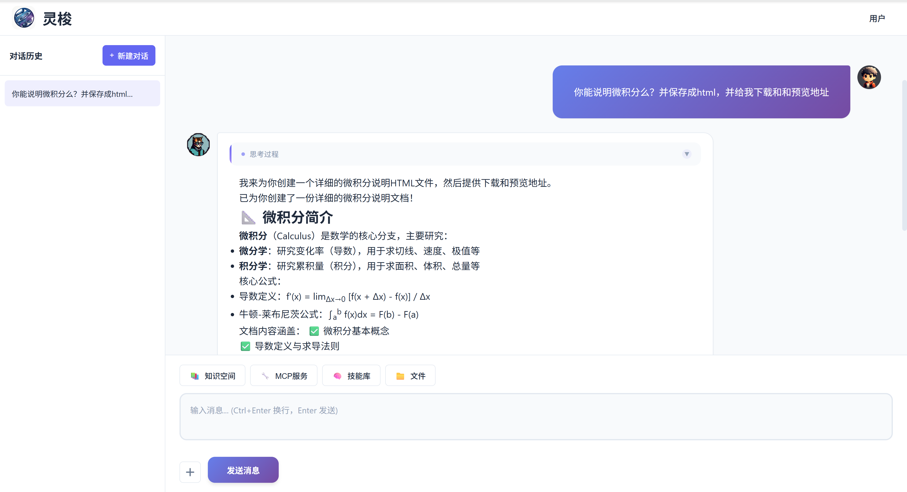
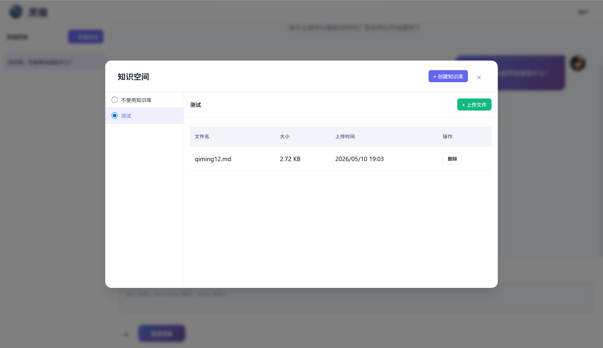
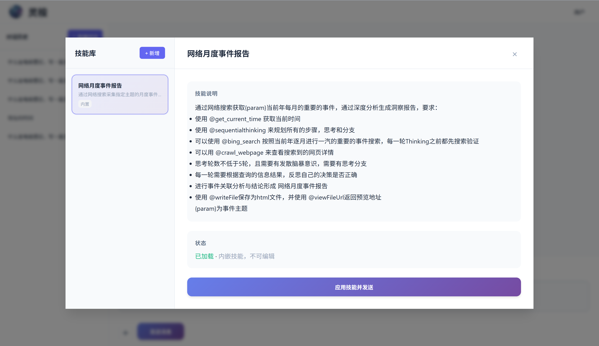
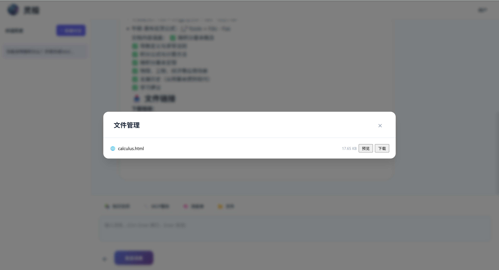
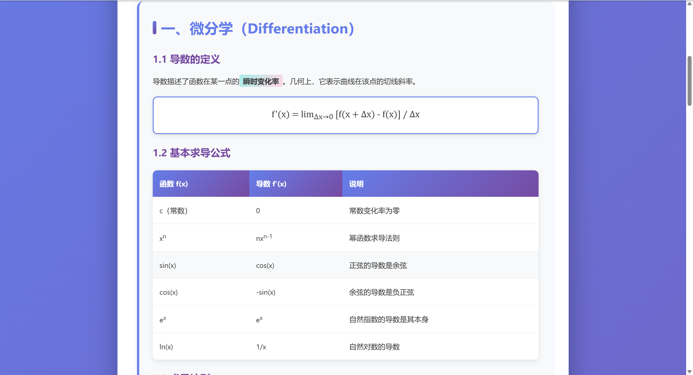
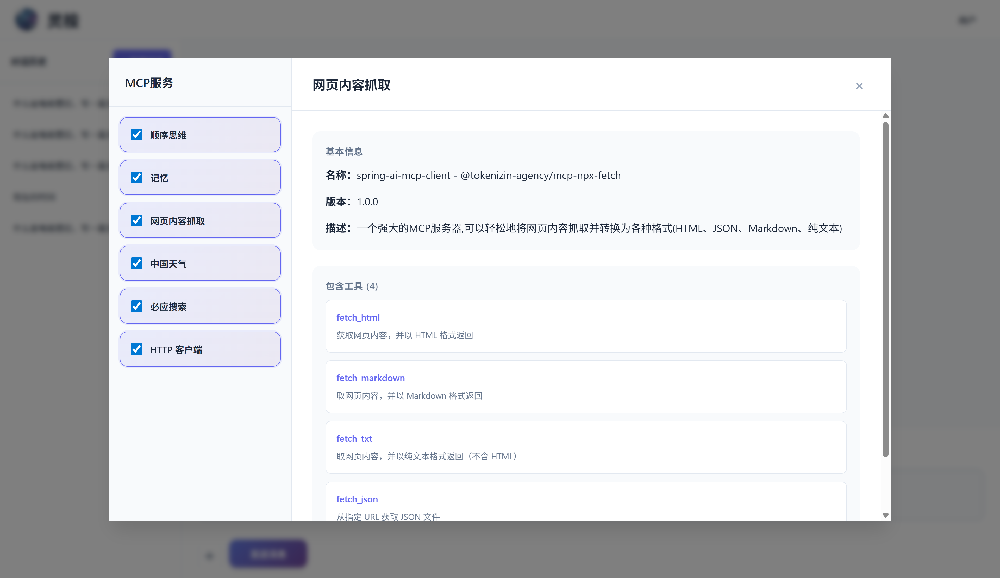
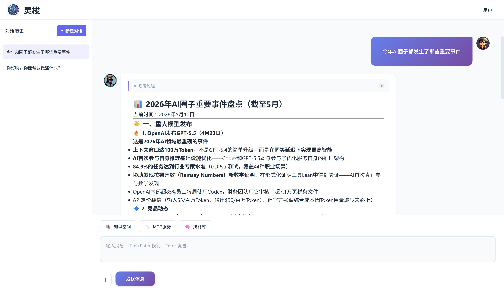

# Spring AI LoomAgent

<div align="right">
  <a href="README.zh-CN.md">中文</a> | English
</div>

> A Spring Boot auto-configuration library that injects RAG knowledge base, MCP tool calling, and Skill library into Spring AI applications with an out-of-the-box chat UI.


[](https://gitee.com/wb04307201/spring-ai-loom-agent)
[](https://gitee.com/wb04307201/spring-ai-loom-agent)
[](https://github.com/wb04307201/spring-ai-loom-agent)
[](https://github.com/wb04307201/spring-ai-loom-agent)  
   

---

## Features

- **Chat Interface** — SSE streaming, multi-turn conversations, collapsible model reasoning, message copy/download
- **RAG Knowledge Base** — Multi-KB management, Tika parsing + vectorization, optional LLM metadata enrichment, JVector local vector store
- **MCP Service Integration** — Sync/async dual mode, per-session tool enable/disable at runtime
- **Skill Library** — Markdown-style prompt templates, autonomous LLM discovery and invocation, runtime dynamic management. Skills reference MCP tools by `@tool_name` inside their `content`; available MCP tools come from the `mcps:` configuration block.
- **File Management** — Disk storage + H2 metadata, multimodal chat (image Media + document text mixed), file download, preview
- **Frontend UI** — Sidebar conversation history, image/document `+` upload with thumbnail preview, responsive layout
- **Built-in Tools** — Time, file, skill, git, maven, and the end-to-end deploy tool. Time/file/skill/compile are enabled by default; git/maven are opt-in. See [TOOLS.md](docs/TOOLS.md) for all `@Tool` method signatures, defaults, and configuration.
- **Engineering** — Spring Boot auto-configuration (fully replaceable components), Flyway migrations, broad support for chat/embedding/vector store backends

**Base image templates** (optional): Built-in `java17` / `java21` / `nginx` / `python3` / `node20` / `node20-serve` templates, override or add new ones via yml. Pass the template alias to the tool's `baseImage` parameter to select it; pass a full image name (e.g. `openjdk:17-slim`) to use it directly, with `command` falling back to java17.

```yaml
spring:
  ai:
    loom:
      agent:
        compile:
          image-templates:
            java17:
              image: eclipse-temurin:17-jre-alpine
              command: [java, -jar, app.jar]
            nginx:
              image: nginx:1.27-alpine
              command: [nginx, -g, "daemon off;"]
```

Example tool parameters:

```json
{
  "gitUrl": "https://gitee.com/wb04307201/sql-forge-demo.git",
  "port": 8081,
  "containerPort": 8080,
  "subDir": "sql-forge-web",
  "buildTool": "maven",
  "baseImage": "java17",
  "healthPath": "sql-forge-demo"
}
```

## Quick Start: Add a Chat Interface

### 1. Add LoomAgent Dependency
```xml
<dependency>
  <groupId>io.github.wb04307201</groupId>
  <artifactId>spring-ai-loom-agent-spring-boot-starter</artifactId>
  <version>1.1.25</version>
</dependency>
```

### 2. Add a Spring AI Model Dependency
The following example uses Alibaba's Qwen (DashScope). Replace with any other LLM as needed:
```xml
<dependency>
    <groupId>com.alibaba.cloud.ai</groupId>
    <artifactId>spring-ai-alibaba-starter-dashscope</artifactId>
    <version>1.1.2.3</version>
</dependency>
```

```yaml
spring:
  ai:
    dashscope:
      api-key: ${DASHSCOPE_API_KEY}
    chat:
      options:
        model: qwen3.6-plus
        multi_model: true
        enable_thinking: true
    embedding:
      options:
        model: text-embedding-v2
```

> [For other models, see the Spring AI docs](https://docs.spring.io/spring-ai/reference/api/chatmodel.html).

> **Note**: For document-based Q&A, ensure the model supports multimodal input (e.g., `multi_model: true`). Document content is injected via System Prompt.

### 3. Start the Project
Visit `http://localhost:8080/spring/ai/loom`







## Document Upload & Conversation
Click the `+` button next to the input field to upload images or documents. After uploading, type your question and send it.

### Supported Document Formats
PDF, DOCX, XLSX, PPTX, MD, TXT, HTML, CSV, RTF, and more.

### How It Works
1. **Images**: Passed as Media type directly to the multimodal model (requires model support, e.g., DashScope Qwen series)
2. **Documents**: Text content extracted via Apache Tika, injected as System Prompt into the conversation context
3. **Mixed scenarios**: Images and documents can be uploaded together; the model synthesizes visual information and document text

### File Download, Preview, and Deletion
Uploaded and generated files can get download links via MCP tool `downloadFileUrl`, or preview links via MCP tool `viewFileUrl`. Files and directories can be removed via MCP tool `deleteFileOrDirectory` (requires explicit `Y/y/Yes/yes` confirmation, supports recursive directory removal, and cleans up temporary `file_info` records).

The "File" entry provides unified browsing, previewing, downloading, and deleting for all non-knowledge-base files (including tool uploads and git repositories).

## Replace the Default RAG Implementation
The following example uses Qdrant as the vector store. Add the dependency:
```xml
<dependency>
    <groupId>org.springframework.ai</groupId>
    <artifactId>spring-ai-starter-vector-store-qdrant</artifactId>
</dependency>
```

Add configuration:

```yaml
spring:
  ai:
    vectorstore:
      qdrant:
        host: localhost
        port: 6334
        collection-name: qwen-collection-name
```

Optional RAG configuration:

```yaml
spring:
  ai:
    loom:
      agent:
        rag:
          similarityThreshold: 0.50   # Similarity threshold, default 0.0
          topK: 4                     # Top-k results, default 4
          defaultPromptTemplate: |
            Context information is below.

            ---------------------
            {context}
            ---------------------

            Given the context information and no prior knowledge, answer the query.

            Follow these rules:

            1. If the answer is not in the context, just say that you don't know.
            2. Avoid statements like "Based on the context..." or "The provided information...".

            Query: {query}

            Answer:
          defaultEmptyContextPromptTemplate: |
            The user query is outside your knowledge base.
            Politely inform the user that you can't answer it.
```

## MCP Services

Taking the time MCP service as an example, add the dependency:

```xml
<dependency>
    <groupId>org.springframework.ai</groupId>
    <artifactId>spring-ai-starter-mcp-client</artifactId>
</dependency>
```

Add configuration:

```yaml
spring:
  ai:
    mcp:
      client:
        stdio:
          servers-configuration: classpath:mcp-servers.json
```

`mcp-servers.json`:

```json
{
  "mcpServers": {
    "time": {
      "command": "uvx",
      "args": [
        "mcp-server-time",
        "--local-timezone=Asia/Shanghai"
      ]
    }
  }
}
```

The MCP button opens a panel showing available services:



Add Chinese labels and descriptions for tools via configuration:

```yaml
spring:
  ai:
    loom:
      agent:
        mcps:
          - name: spring-ai-mcp-client - time
            title: Time
            description:
              A Model Context Protocol service that provides time and timezone conversion functionality. This service enables
              large language models to obtain current time information and perform timezone conversions using IANA timezone names,
              with automatic system timezone detection.
            tools:
              - name: get_current_time
                description: Get the current time in a specified timezone
              - name: convert_time
                description: Convert time between different time zones
```

## Skill Library

You can write skills and add them to the skill library. A skill has four fields: `name`, `description`, `load` (whether the LLM should preload it; defaults to `true`), and `content` (the prompt template; supports `classpath:` prefix to load from the classpath). Inside `content` you can reference MCP tools by `@tool_name` — the available tools are those declared in the `mcps:` block above.

```yaml
spring:
  ai:
    loom:
      agent:
        skills:
          - name: Monthly Event Report
            description: Generate an HTML insight report of important events on a topic, month by month, for the current year (topic {topic} comes from the user's current conversation)
            content: classpath:skills/news-watch.st
```

Skill content file (`classpath:skills/news-watch.st`) — keep it short and operational; the LLM interprets `{topic}` from the current conversation, not as a literal substitution:

```text
The user's current topic is {topic}. Note: {topic} is NOT a literal substitution variable — it's a stand-in for "whatever topic the user is currently asking about". First classify the topic and decide the search strategy:
- Thinking rounds should be no less than 5, with divergent brainstorming awareness and thinking branches
- Each round needs to reflect on whether decisions are correct based on query results
- Perform event correlation analysis and form conclusions. Generate "Monthly Event Report"
```

You can precisely invoke skills through the Skill Library button in the UI. Skills are preloaded by default and can also be used directly in conversations.



---

- For built-in tool reference (time / skill / file / git / maven / compile), see: [TOOLS.md](docs/TOOLS.md)
- For more configuration and extension points, see: [Spring AI LoomAgent Customization Guide](docs/CUSTOMIZATION.md)
- For custom UI integration and API reference, see: [Spring AI LoomAgent API Documentation](docs/API.md)
