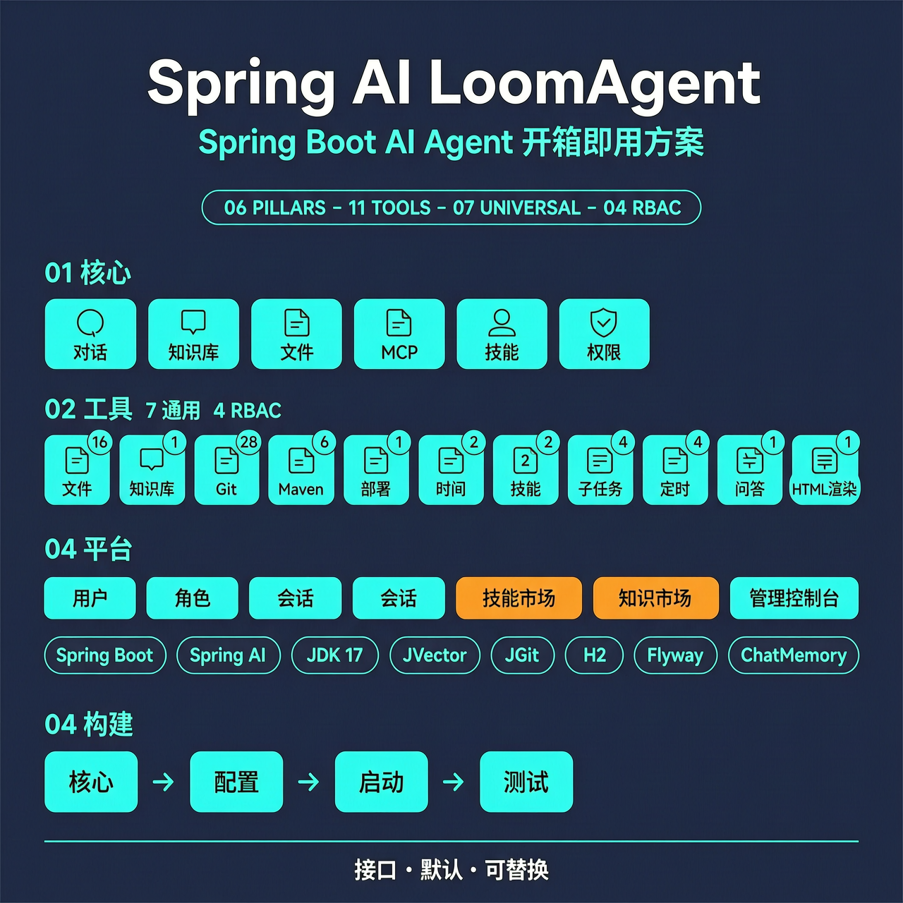
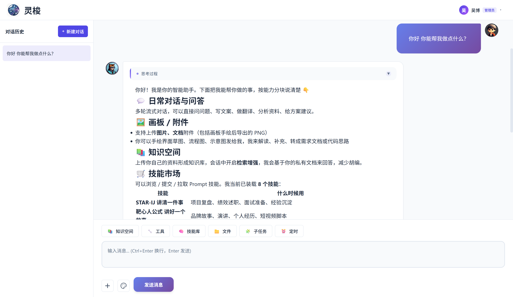
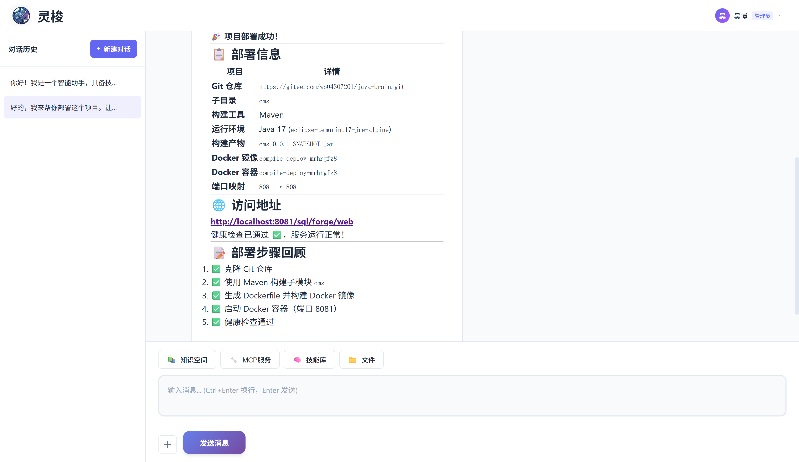

# Spring AI LoomAgent —— 灵梭

<div align="right">
  <a href="README.md">English</a> | 中文
</div>

> Spring Boot AI Agent 开箱即用解决方案——让你的应用 **能对话**、**有记忆**、**会思考**、**可动手**。


[](https://gitee.com/wb04307201/spring-ai-loom-agent)
[](https://gitee.com/wb04307201/spring-ai-loom-agent)
[](https://github.com/wb04307201/spring-ai-loom-agent)
[](https://github.com/wb04307201/spring-ai-loom-agent)  
   

<p style="display: flex">
  
  
</p>

---

## 功能特性
- **对话交互** — SSE 流式聊天，多轮对话，模型推理过程折叠展示，消息复制/下载
- **RAG 知识库** — 多知识库管理，Tika 文档解析 + 向量化，可选 LLM 元数据增强，JVector 本地向量存储
- **MCP 服务集成** — 同步/异步双模式，运行时按会话启用/禁用
- **Skill 技能库** — Markdown 风格 prompt 模板，LLM 自主发现与调用，运行时动态管理。技能通过 `content` 里的 `@工具名` 引用 MCP 工具，可用 MCP 由 `mcps:` 配置块决定。
- **文件管理** — 磁盘存储 + H2 元数据，多模态聊天（图片 Media + 文档文本混合），文件下载，预览
- **前端 UI** — 侧边栏对话历史，图片/文档 `+` 按钮上传与缩略图预览，响应式布局
- **内置工具** — 时间、文件、技能、Git、Maven 及端到端部署工具。时间/文件/技能/部署默认启用，Git/Maven 需 opt-in 开启。详细方法签名、默认值、配置见 [TOOLS.zh-CN.md](docs/TOOLS.zh-CN.md)。
- **工程化** — Spring Boot 自动配置（全组件可替换），Flyway 迁移，广泛支持多种聊天/嵌入/向量存储后端

## 内置工具

所有工具遵循 **接口 + 默认实现** 模式。每个组件均通过 `@ConditionalOnMissingBean` 注册，用户可提供自定义实现替换任意组件。

| 工具 | 接口 | 方法数 | 默认状态 | 配置属性 |
|------|------|--------|----------|----------|
| 时间 | `ITimeTool` | 2 | ✅ 启用 | `time.enabled` |
| 文件 | `IFileTool` | 16 | ✅ 启用 | `file.enabled` |
| 技能 | `ISkillTool` | 2 | ✅ 启用 | `skill.enabled` |
| Git | `IGitTool` | 28 | ❌ 禁用 | `git.enabled` |
| Maven | `IMavenTool` | 6 | ❌ 禁用 | `maven.enabled` |
| 编译部署 | `ICompileAndDeployTool` | 1 | ✅ 启用 | `compile.enabled` |

完整的 `@Tool` 方法签名、参数说明和配置参考见 [TOOLS.zh-CN.md](docs/TOOLS.zh-CN.md)。

### 编译部署工具


### 独立 MCP 服务

文件、Git、Maven、编译部署各有**独立 MCP 服务模块** — core 层无 Spring 依赖，可通过 jbang 以 stdio 模式运行，供 Claude Desktop、Cursor 等任何 MCP 兼容 agent 使用：

| MCP 服务 | 说明 | README |
|----------|------|--------|
| `loom-file-mcp` | 文件系统操作 — 读写、编辑、搜索、目录浏览、删除（14 个工具） | [EN](loom-file-mcp/README.md) · [中文](loom-file-mcp/README.zh-CN.md) |
| `loom-git-mcp` | 基于 JGit 的 Git 操作 — clone、commit、push、merge、rebase 等（14 个工具） | [EN](loom-git-mcp/README.md) · [中文](loom-git-mcp/README.zh-CN.md) |
| `loom-maven-mcp` | Maven 构建操作 — 执行、编译、打包、测试、依赖树、校验（6 个工具） | [EN](loom-maven-mcp/README.md) · [中文](loom-maven-mcp/README.zh-CN.md) |
| `loom-compile-mcp` | 端到端部署流水线 — git clone → 构建 → docker build → docker run → 健康检查（1 个工具） | [EN](loom-compile-mcp/README.md) · [中文](loom-compile-mcp/README.zh-CN.md) |

## 快速添加聊天界面
### 1. 引入聊天依赖
```xml
<dependency>
    <groupId>io.github.wb04307201</groupId>
    <artifactId>spring-ai-loom-agent-spring-boot-starter</artifactId>
    <version>1.1.32</version>
</dependency>
```

### 2. 添加Spring AI模型依赖
下面以阿里qwen大模型为例进行说明，可以按需替换成其它大语言模型依赖与配置：
```xml
<dependency>
    <groupId>com.alibaba.cloud.ai</groupId>
    <artifactId>spring-ai-alibaba-starter-dashscope</artifactId>
    <version>1.1.2.3</version>
</dependency>
```
```yaml
spring:
  ai:
    dashscope:
      api-key: ${DASHSCOPE_API_KEY}
    chat:
      options:
        model: qwen3.7-plus
        multi_model: true
        enable_thinking: true
    embedding:
      options:
        model: text-embedding-v2
```

> [使用其他模型可参考](https://docs.spring.io/spring-ai/reference/api/chatmodel.html)

> **注意**: 如需基于文档进行问答，请确保模型支持多模态输入（如 `multi_model: true`），文档内容会通过 System Prompt 注入。

### 3. 启动项目
访问`http://localhost:8080/spring/ai/loom`


## 文档上传与对话
点击输入框左侧 `+` 按钮，可上传图片或文档文件。上传后在输入框中输入问题发送即可。

### 支持的文档格式
PDF、DOCX、XLSX、PPTX、MD、TXT、HTML、CSV、RTF 等。

### 工作原理
1. **图片**: 作为 Media 类型直接传递给多模态大模型（需模型支持，如 DashScope qwen 系列）
2. **文档**: 通过 Apache Tika 提取文本内容，作为 System Prompt 注入对话上下文
3. **混合场景**: 可同时上传图片和文档，模型会综合图片视觉信息与文档文本内容进行回答

### 文件下载、预览和删除
上传和生成的文件可通过 MCP 工具 `downloadFileUrl` 获取下载链接，也可以通过 MCP 工具 `viewFileUrl` 获取预览链接。文件和目录可通过 MCP 工具 `deleteFileOrDirectory` 删除（需显式传入 `I_CONFIRM_DELETE` 确认 — token 可在 `spring.ai.loom.agent.file.deleteConfirmToken` 改，支持递归删除目录，并清理已删除文件对应的临时 `file_info` 记录）。

"文件"入口可统一查看、预览、下载和删除所有非知识库文件（含工具上传的文件和 git 仓库）。

## 更换其它RAG以替换默认实现
下面以qdrant向量数据库为例，添加依赖和配置：
```xml
<dependency>
    <groupId>org.springframework.ai</groupId>
    <artifactId>spring-ai-starter-vector-store-qdrant</artifactId>
</dependency>
```

添加配置：
```yaml
spring:
  ai:
    vectorstore:
      qdrant:
        host: localhost
        port: 6334
        collection-name: qwen-collection-name
```

其它rag可选配置如下：
```yaml
spring:
  ai:
    loom:
      agent:
        rag:
          similarityThreshold: 0.50   # 相似度阈值,默认0.0
          top-k: 4                    # top-k，默认4
          defaultPromptTemplate: |
            Context information is below.

            ---------------------
            {context}
            ---------------------

            Given the context information and no prior knowledge, answer the query.

            Follow these rules:

            1. If the answer is not in the context, just say that you don't know.
            2. Avoid statements like "Based on the context..." or "The provided information...".

            Query: {query}

            Answer:
          defaultEmptyContextPromptTemplate: |
            The user query is outside your knowledge base.
            Politely inform the user that you can't answer it.
```

## MCP服务
以时间MCP服务为例，添加依赖：
```xml
<dependency>
    <groupId>org.springframework.ai</groupId>
    <artifactId>spring-ai-starter-mcp-client</artifactId>
</dependency>
```

添加配置：
```yaml
spring:
  ai:
    mcp:
      client:
        stdio:
          servers-configuration: classpath:mcp-servers.json
```

mcp-servers.json:
```json
{
  "mcpServers": {
    "time": {
      "command": "uvx",
      "args": [
        "mcp-server-time",
        "--local-timezone=Asia/Shanghai"
      ]
    }
  }
}
```

MCP服务按钮可弹出面板查看目前拥有的MCP服务信息：


可以通过配置为工具添加中文名和描述：
```yaml
spring:
  ai:
    loom:
      agent:
        mcps:
          - name: spring-ai-mcp-client - time
            title: 时间
            description:
              一个提供时间和时区转换功能的模型上下文协议服务。该服务使大型语言模型能够获取当前时间信息，并使用IANA时区名称进行时区转换，同时具备自动检测系统时区的功能。
            tools:
              - name: get_current_time
                description: 获取指定时区的当前时间
              - name: convert_time
                description: 在不同时区之间转换时间
```

## 技能库
可以编写技能加入技能库。一个技能只有 4 个字段：`name` / `description` / `load`（是否预加载到 LLM，默认 `true`） / `content`（prompt 模板，支持 `classpath:` 前缀从 classpath 加载）。`content` 里通过 `@工具名` 引用 MCP 工具，可用 MCP 由上文 `mcps:` 配置块决定。

```yaml
spring:
  ai:
    loom:
      agent:
        skills:
          - name: 网络月度事件报告
            description: 围绕一个主题，按月梳理当年的重要事件并产出 HTML 洞察报告（主题 {topic} 来自用户当前对话）
            content: classpath:skills/news-watch.st
```

技能内容文件 `classpath:skills/news-watch.st`（保持简短、聚焦操作，LLM 把 `{topic}` 解释为"用户当前对话里聊的主题"，不是字面替换）：

```text
用户当前对话的主题暂记为 {topic}。注意：{topic} 不是字面替换变量，是「用户最近在问的那个主题」的代称。
先判断它属于哪一类，决定搜索策略：
- 思考轮数 ≥ 5，每轮反思"是否覆盖到位"
- 每一轮需要根据查询的信息结果，反思自己的决策是否正确
- 进行事件关联分析与结论形成 网络月度事件报告
```

可以通过技能库按钮精准使用技能 ，
技能默认设置了预加载，也通过对话直接使用


---

- 内置工具详细说明（时间/技能/文件/Git/Maven/编译部署）：[TOOLS.zh-CN.md](docs/TOOLS.zh-CN.md)
- 独立 MCP 服务用法（文件/Git/Maven/编译部署）：见上方 [内置工具 → 独立 MCP 服务](#独立-mcp-服务) 章节
- 其他配置和扩展点说明：[Spring AI LoomAgent 自定义能力总览](docs/CUSTOMIZATION.zh-CN.md)
- 自定义UI界面对接API参考：[Spring AI LoomAgent API 文档](docs/API.zh-CN.md)

